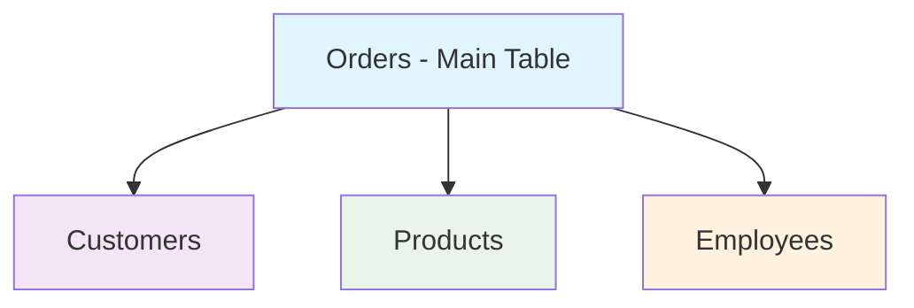

# SQL Joins Mastery Guide 🔗

A comprehensive guide to SQL joins that enable combining data from multiple tables to unlock powerful insights and create meaningful relationships in your database queries.

## Table of Contents

- [[#Understanding Joins Fundamentals|🎯 Understanding Joins Fundamentals]]
- [[#Basic Joins|🌟 Basic Joins]]
    - [[#INNER JOIN|INNER JOIN]]
    - [[#LEFT JOIN|LEFT JOIN]]
    - [[#RIGHT JOIN|RIGHT JOIN]]
    - [[#FULL JOIN|FULL JOIN]]
- [[#Advanced Joins|🚀 Advanced Joins]]
    - [[#Anti Joins|Anti Joins]]
    - [[#Alternative Join Techniques|Alternative Join Techniques]]
    - [[#CROSS JOIN|CROSS JOIN]]
- [[#Multiple Table Joins|🏗️ Multiple Table Joins]]
- [[#Join Performance Tips|⚡ Join Performance Tips]]
- [[#Common Join Patterns|📋 Common Join Patterns]]

---

## Understanding Joins Fundamentals 🎯

### What Are Joins?

Joins are SQL operations that combine rows from two or more tables based on related columns between them. Think of joins as bridges that connect different data islands in your database.

### Why Use Joins?

- **Data Normalization**: Avoid data duplication by storing related information in separate tables
- **Meaningful Relationships**: Connect customers to their orders, products to categories, etc.
- **Comprehensive Reports**: Create detailed reports combining information from multiple sources
- **Data Integrity**: Maintain consistency across related tables

### Join Visualization

```
Table A (Customers)     Table B (Orders)
┌────────────────┐     ┌──────────────────┐
│ ID │ Name      │     │ Order │ Customer │
├────┼───────────┤     │  ID   │    ID    │
│ 1  │ Alice     │ ──┐ ├───────┼──────────┤
│ 2  │ Bob       │   └─│  101  │    1     │
│ 3  │ Charlie   │     │  102  │    2     │
└────────────────┘     │  103  │    4     │
                       └──────────────────┘
```

> [!info] Key Concept Joins work by matching values in specified columns (usually primary and foreign keys) to determine which rows should be combined.

---

## Basic Joins 🌟

### No Join (Separate Results)

Before diving into joins, let's see what happens without them:

```sql
-- Retrieve all data from customers and orders as separate results
SELECT * FROM customers;
SELECT * FROM orders;
```

> [!note] Problem with No Joins This approach gives you disconnected data - you can't easily see which customer placed which order.

---

### INNER JOIN

**Purpose**: Returns only the rows that have matching values in both tables.

```sql
-- Get all customers along with their orders, 
-- but only for customers who have placed an order
SELECT
    c.id,
    c.first_name,
    o.order_id,
    o.sales
FROM customers AS c
INNER JOIN orders AS o
ON c.id = o.customer_id;
```

#### Visual Representation

```
Customers (A)    Orders (B)     Result (A ∩ B)
┌─────────────┐  ┌───────────┐  ┌─────────────────┐
│ 1 │ Alice   │  │ 101 │ 1   │  │ 1 │ Alice │ 101 │
│ 2 │ Bob     │  │ 102 │ 2   │  │ 2 │ Bob   │ 102 │
│ 3 │ Charlie │  │ 103 │ 4   │  └─────────────────┘
└─────────────┘  └───────────┘
```

> [!tip] When to Use INNER JOIN
> 
> - When you only want records that exist in both tables
> - Perfect for finding customers who have orders, products that have been sold, etc.
> - Most restrictive join - smallest result set

---

### LEFT JOIN

**Purpose**: Returns all rows from the left table, and matching rows from the right table. Non-matching rows from the right table will show NULL values.

```sql
-- Get all customers along with their orders, 
-- including those without orders
SELECT
    c.id,
    c.first_name,
    o.order_id,
    o.sales
FROM customers AS c
LEFT JOIN orders AS o
ON c.id = o.customer_id;
```

#### Visual Representation

```
Customers (A)    Orders (B)     Result (A + matching B)
┌─────────────┐  ┌───────────┐  ┌─────────────────────┐
│ 1 │ Alice   │  │ 101 │ 1   │  │ 1 │ Alice   │ 101   │
│ 2 │ Bob     │  │ 102 │ 2   │  │ 2 │ Bob     │ 102   │
│ 3 │ Charlie │  │ 103 │ 4   │  │ 3 │ Charlie │ NULL  │
└─────────────┘  └───────────┘  └─────────────────────┘
```

> [!tip] When to Use LEFT JOIN
> 
> - When you want all records from the first table regardless of matches
> - Perfect for finding all customers (including those without orders)
> - Use when the left table is your "master" table

---

### RIGHT JOIN

**Purpose**: Returns all rows from the right table, and matching rows from the left table. Non-matching rows from the left table will show NULL values.

```sql
-- Get all orders along with customer information,
-- including orders without matching customers
SELECT
    c.id,
    c.first_name,
    o.order_id,
    o.customer_id,
    o.sales
FROM customers AS c 
RIGHT JOIN orders AS o 
ON c.id = o.customer_id;
```

#### Alternative Approach (Recommended)

```sql
-- Same result using LEFT JOIN (more intuitive)
SELECT
    c.id,
    c.first_name,
    o.order_id,
    o.sales
FROM orders AS o 
LEFT JOIN customers AS c
ON c.id = o.customer_id;
```

> [!info] RIGHT JOIN vs LEFT JOIN RIGHT JOIN is less commonly used because it can be confusing. Most developers prefer to rewrite RIGHT JOINs as LEFT JOINs by switching table order.

---

### FULL JOIN

**Purpose**: Returns all rows when there's a match in either table. Shows NULL values where there are no matches.

```sql
-- Get all customers and all orders, even if there's no match
SELECT
    c.id,
    c.first_name,
    o.order_id,
    o.customer_id,
    o.sales
FROM customers AS c 
FULL JOIN orders AS o 
ON c.id = o.customer_id;
```

#### Visual Representation

```
Customers (A)    Orders (B)     Result (A ∪ B)
┌─────────────┐  ┌───────────┐  ┌─────────────────────┐
│ 1 │ Alice   │  │ 101 │ 1   │  │ 1 │ Alice   │ 101   │
│ 2 │ Bob     │  │ 102 │ 2   │  │ 2 │ Bob     │ 102   │
│ 3 │ Charlie │  │ 103 │ 4   │  │ 3 │ Charlie │ NULL  │
└─────────────┘  └───────────┘  │ NULL│ NULL  │ 103   │
                                └─────────────────────┘
```

> [!warning] Database Support Not all databases support FULL JOIN (notably MySQL doesn't). You can achieve the same result using UNION of LEFT and RIGHT JOINs.

---

## Advanced Joins 🚀

### Anti Joins

Anti joins help you find records that DON'T have matches in another table.

#### LEFT ANTI JOIN

**Purpose**: Find records in the left table that have no matching records in the right table.

```sql
-- Get all customers who haven't placed any order
SELECT *
FROM customers AS c
LEFT JOIN orders AS o
ON c.id = o.customer_id
WHERE o.customer_id IS NULL;
```

> [!tip] Business Use Cases
> 
> - Find customers who haven't made purchases (for marketing campaigns)
> - Identify products that haven't been sold
> - Locate employees without assigned tasks

#### RIGHT ANTI JOIN

```sql
-- Get all orders without matching customers (orphaned orders)
SELECT *
FROM customers AS c
RIGHT JOIN orders AS o
ON c.id = o.customer_id
WHERE c.id IS NULL;

-- Alternative using LEFT JOIN (preferred)
SELECT *
FROM orders AS o 
LEFT JOIN customers AS c
ON c.id = o.customer_id
WHERE c.id IS NULL;
```

#### FULL ANTI JOIN

**Purpose**: Find records that exist in either table but don't have matches in the other.

```sql
-- Find customers without orders AND orders without customers
SELECT
    c.id,
    c.first_name,
    o.order_id,
    o.customer_id,
    o.sales
FROM customers AS c 
FULL JOIN orders AS o 
ON c.id = o.customer_id
WHERE o.customer_id IS NULL OR c.id IS NULL;
```

### Alternative Join Techniques

#### INNER JOIN Alternative

```sql
-- Alternative to INNER JOIN using LEFT JOIN + WHERE
SELECT *
FROM customers AS c
LEFT JOIN orders AS o
ON c.id = o.customer_id
WHERE o.customer_id IS NOT NULL;
```

> [!info] Why Use Alternatives?
> 
> - Consistency in coding style
> - Some databases optimize differently
> - Personal/team preferences

---

### CROSS JOIN

**Purpose**: Returns the Cartesian product of both tables - every row from the first table combined with every row from the second table.

```sql
-- Generate all possible combinations of customers and orders
SELECT *
FROM customers
CROSS JOIN orders;
```

#### Result Size Calculation

```
If customers has 100 rows and orders has 50 rows:
CROSS JOIN result = 100 × 50 = 5,000 rows
```

> [!danger] Use with Caution CROSS JOIN can create enormous result sets very quickly. Always ensure this is what you actually need!

#### Practical Use Cases

- **Product Combinations**: All possible product + color combinations
- **Scheduling**: All possible time slots × available resources
- **Test Data Generation**: Creating comprehensive test datasets

---

## Multiple Table Joins 🏗️

### Real-World Example: Sales Database

**Scenario**: Create a comprehensive order report combining data from 4 tables:

- Orders (transaction details)
- Customers (buyer information)
- Products (item details)
- Employees (salesperson info)

```sql
-- Complete order report with customer, product, and employee details
USE SalesDB;

SELECT 
    o.OrderID,
    o.Sales,
    -- Customer Information
    CONCAT(c.FirstName, ' ', c.LastName) AS CustomerName,
    c.Email AS CustomerEmail,
    c.City AS CustomerCity,
    
    -- Product Information
    p.Product AS ProductName,
    p.Price AS ProductPrice,
    p.Category AS ProductCategory,
    
    -- Employee Information
    CONCAT(e.FirstName, ' ', e.LastName) AS SalespersonName,
    e.Department AS SalespersonDepartment,
    
    -- Calculated Fields
    (o.Sales - p.Price) AS Profit,
    CASE 
        WHEN o.Sales > p.Price * 2 THEN 'High Margin'
        WHEN o.Sales > p.Price * 1.5 THEN 'Medium Margin'
        ELSE 'Low Margin'
    END AS ProfitCategory
    
FROM Sales.Orders AS o
LEFT JOIN Sales.Customers AS c
    ON o.CustomerID = c.CustomerID
LEFT JOIN Sales.Products AS p
    ON o.ProductID = p.ProductID
LEFT JOIN Sales.Employees AS e
    ON o.SalesPersonID = e.EmployeeID
ORDER BY o.OrderID;
```

### Join Order Strategy



> [!tip] Best Practices for Multiple Joins
> 
> 1. **Start with the main table** (usually the one with foreign keys)
> 2. **Use LEFT JOIN** for optional relationships
> 3. **Use meaningful aliases** for readability
> 4. **Order joins logically** - most important relationships first
> 5. **Consider performance** - add WHERE clauses early to reduce dataset size

---

## Join Performance Tips ⚡

### Indexing Strategy

```sql
-- Create indexes on join columns for better performance
CREATE INDEX idx_orders_customer_id ON orders(customer_id);
CREATE INDEX idx_orders_product_id ON orders(product_id);
CREATE INDEX idx_customers_id ON customers(id);
```

### Query Optimization Techniques

#### 1. Filter Early

```sql
-- ✅ Good: Filter before joining
SELECT c.name, o.order_date
FROM customers c
JOIN (
    SELECT customer_id, order_date 
    FROM orders 
    WHERE order_date >= '2024-01-01'
) o ON c.id = o.customer_id;

-- ❌ Less efficient: Filter after joining
SELECT c.name, o.order_date
FROM customers c
JOIN orders o ON c.id = o.customer_id
WHERE o.order_date >= '2024-01-01';
```

#### 2. Select Only Needed Columns

```sql
-- ✅ Good: Select specific columns
SELECT c.name, o.total
FROM customers c
JOIN orders o ON c.id = o.customer_id;

-- ❌ Less efficient: Select all columns
SELECT *
FROM customers c
JOIN orders o ON c.id = o.customer_id;
```

#### 3. Use Appropriate Join Types

```sql
-- If you know matches exist, use INNER JOIN (faster)
SELECT c.name, o.total
FROM customers c
INNER JOIN orders o ON c.id = o.customer_id;

-- Only use LEFT JOIN when you need non-matching rows
SELECT c.name, COALESCE(o.total, 0) as total
FROM customers c
LEFT JOIN orders o ON c.id = o.customer_id;
```

---

## Common Join Patterns 📋

### 1. Master-Detail Relationship

```sql
-- Orders with order details
SELECT 
    o.order_id,
    o.order_date,
    od.product_id,
    od.quantity,
    od.unit_price
FROM orders o
JOIN order_details od ON o.order_id = od.order_id;
```

### 2. Many-to-Many Relationships

```sql
-- Students and courses (through enrollment table)
SELECT 
    s.student_name,
    c.course_name,
    e.grade
FROM students s
JOIN enrollments e ON s.student_id = e.student_id
JOIN courses c ON e.course_id = c.course_id;
```

### 3. Hierarchical Data

```sql
-- Employee and manager relationship
SELECT 
    emp.name AS employee_name,
    mgr.name AS manager_name
FROM employees emp
LEFT JOIN employees mgr ON emp.manager_id = mgr.employee_id;
```

### 4. Aggregation with Joins

```sql
-- Customer order summary
SELECT 
    c.customer_name,
    COUNT(o.order_id) AS total_orders,
    SUM(o.total_amount) AS total_spent,
    AVG(o.total_amount) AS avg_order_value
FROM customers c
LEFT JOIN orders o ON c.customer_id = o.customer_id
GROUP BY c.customer_id, c.customer_name;
```

---

## Join Types Quick Reference 📊

|Join Type|Description|Use Case|Result Size|
|---|---|---|---|
|**INNER**|Only matching rows|Find related records|Smallest|
|**LEFT**|All left + matching right|Keep all from main table|Left table size|
|**RIGHT**|All right + matching left|Rarely used|Right table size|
|**FULL**|All rows from both tables|Complete data picture|Largest|
|**CROSS**|All combinations|Cartesian product|Left × Right|
|**ANTI**|Non-matching rows|Find missing relationships|Varies|

---

## Troubleshooting Common Issues 🔧

### Issue 1: Unexpected Result Counts

```sql
-- Problem: Getting more rows than expected
-- Solution: Check for duplicate join keys

-- Investigate duplicates
SELECT customer_id, COUNT(*) 
FROM orders 
GROUP BY customer_id 
HAVING COUNT(*) > 1;
```

### Issue 2: Missing Data

```sql
-- Problem: Expected data not appearing
-- Solution: Check join conditions and use LEFT JOIN

-- Debug missing customers
SELECT c.*, o.order_id
FROM customers c
LEFT JOIN orders o ON c.id = o.customer_id
WHERE o.order_id IS NULL;
```

### Issue 3: Performance Issues

```sql
-- Problem: Slow join queries
-- Solution: Add proper indexes and analyze execution plan

EXPLAIN SELECT c.name, o.total
FROM customers c
JOIN orders o ON c.id = o.customer_id;
```

---

## Practice Exercises 💪

### Exercise 1: Basic Joins

```sql
-- Find all customers with their total order count and amount
-- Include customers with no orders (show 0 for counts)
```

### Exercise 2: Complex Joins

```sql
-- Create a report showing:
-- - Product name
-- - Category
-- - Total sales
-- - Number of different customers who bought it
-- - Average sale price
```

### Exercise 3: Anti Joins

```sql
-- Find products that have never been ordered
-- Find customers who haven't ordered in the last 30 days
```

---

## Tags

#sql #database #joins #inner-join #left-join #right-join #full-join #anti-join #cross-join #multiple-tables #query-optimization #relationships #data-analysis