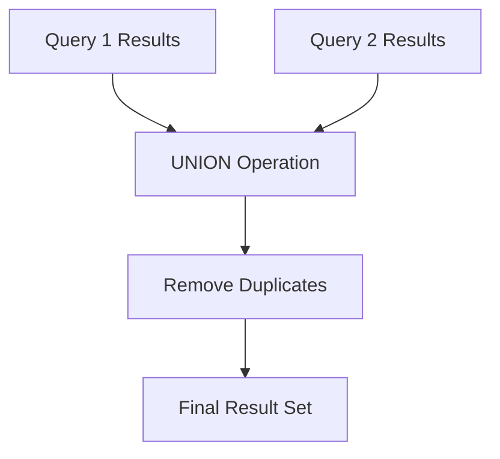
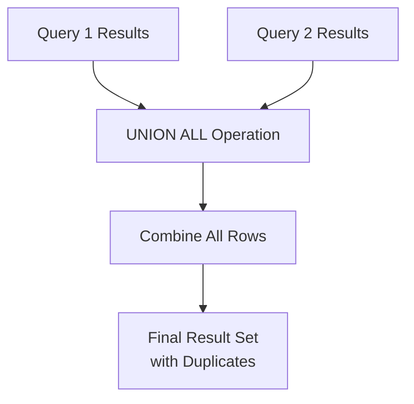
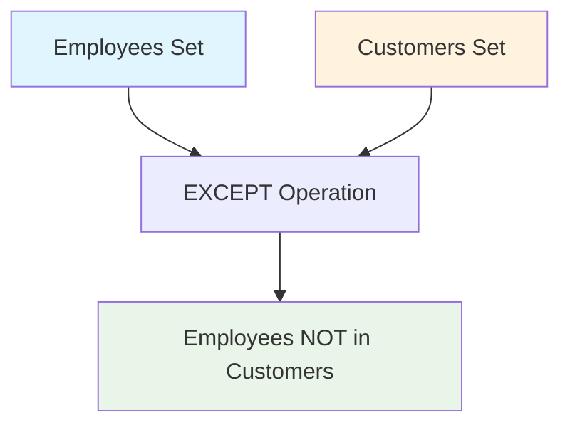
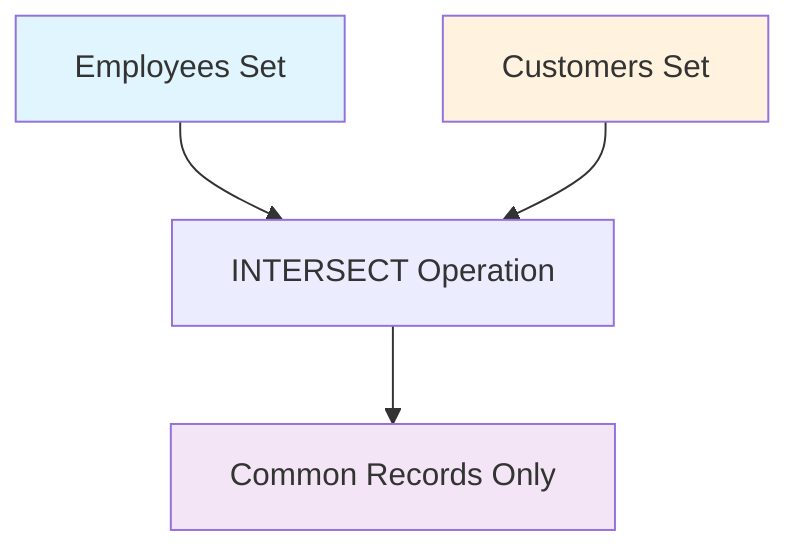

# SQL Set Operations Guide 🔄

SQL set operations enable you to combine results from multiple queries into a single result set, allowing for powerful data analysis and reporting capabilities. Master these operations to efficiently merge, compare, and analyze data from multiple sources.

## 📋 Table of Contents

- [[#Set Operation Rules|🔧 Set Operation Rules]]
- [[#UNION Operation|🔗 UNION Operation]]
- [[#UNION ALL Operation|🔗 UNION ALL Operation]]
- [[#EXCEPT Operation|❌ EXCEPT Operation]]
- [[#INTERSECT Operation|🔄 INTERSECT Operation]]
- [[#Real-World Examples|🌟 Real-World Examples]]
- [[#Performance Considerations|⚡ Performance Considerations]]

---

## 🔧 Set Operation Rules

Before diving into specific operations, it's crucial to understand the fundamental rules that govern all SQL set operations. Violating these rules will result in query errors.

### 📊 Rule 1: Data Types Must Match

**The data types of corresponding columns in each query must be compatible.**

> [!danger] ❌ **INCORRECT Example**
> 
> ```sql
> -- This will FAIL: Column count mismatch
> SELECT
>     FirstName,      -- VARCHAR
>     LastName,       -- VARCHAR
>     Country         -- VARCHAR (3 columns)
> FROM Sales.Customers
> UNION
> SELECT
>     FirstName,      -- VARCHAR
>     LastName        -- VARCHAR (2 columns)
> FROM Sales.Employees;
> ```

> [!danger] ❌ **INCORRECT Example**
> 
> ```sql
> -- This will FAIL: Data type mismatch
> SELECT
>     CustomerID,     -- INT
>     LastName        -- VARCHAR
> FROM Sales.Customers
> UNION
> SELECT
>     FirstName,      -- VARCHAR (should be INT)
>     LastName        -- VARCHAR
> FROM Sales.Employees;
> ```

> [!success] ✅ **CORRECT Example**
> 
> ```sql
> -- This works: Same column count and compatible data types
> SELECT
>     FirstName,      -- VARCHAR
>     LastName        -- VARCHAR
> FROM Sales.Customers
> UNION
> SELECT
>     FirstName,      -- VARCHAR
>     LastName        -- VARCHAR
> FROM Sales.Employees;
> ```

### 🔄 Rule 2: Column Order Must Match

**The order and position of columns in each SELECT statement must be identical.**

> [!danger] ❌ **INCORRECT Example**
> 
> ```sql
> -- This will produce unexpected results: Column order mismatch
> SELECT
>     LastName,       -- Position 1: VARCHAR
>     CustomerID      -- Position 2: INT
> FROM Sales.Customers
> UNION
> SELECT
>     EmployeeID,     -- Position 1: INT (wrong position!)
>     LastName        -- Position 2: VARCHAR (wrong position!)
> FROM Sales.Employees;
> ```

> [!success] ✅ **CORRECT Example**
> 
> ```sql
> -- This works: Consistent column order
> SELECT
>     CustomerID,     -- Position 1: INT
>     LastName        -- Position 2: VARCHAR
> FROM Sales.Customers
> UNION
> SELECT
>     EmployeeID,     -- Position 1: INT
>     LastName        -- Position 2: VARCHAR
> FROM Sales.Employees;
> ```

### 🏷️ Rule 3: Column Names from First Query

**The result set column names are determined by the first SELECT statement.**

```sql
-- Column names in result: 'ID' and 'Last_Name'
SELECT
    CustomerID AS ID,           -- This alias will be used
    LastName AS Last_Name       -- This alias will be used
FROM Sales.Customers
UNION
SELECT
    EmployeeID,                 -- Alias ignored
    LastName                    -- Alias ignored
FROM Sales.Employees;
```

> [!tip] **Best Practice** Always use meaningful column aliases in the first SELECT statement to ensure clear result set headers.

### 🎯 Rule 4: Logical Column Consistency

**Ensure columns represent the same logical data across all queries.**

> [!danger] ❌ **INCORRECT Example**
> 
> ```sql
> -- This is technically valid but logically wrong
> SELECT
>     FirstName,      -- First name in position 1
>     LastName        -- Last name in position 2
> FROM Sales.Customers
> UNION
> SELECT
>     LastName,       -- Last name in position 1 (WRONG!)
>     FirstName       -- First name in position 2 (WRONG!)
> FROM Sales.Employees;
> ```

> [!success] ✅ **CORRECT Example**
> 
> ```sql
> -- Logically consistent column mapping
> SELECT
>     FirstName,      -- First name in position 1
>     LastName        -- Last name in position 2
> FROM Sales.Customers
> UNION
> SELECT
>     FirstName,      -- First name in position 1
>     LastName        -- Last name in position 2
> FROM Sales.Employees;
> ```

---

## 🔗 UNION Operation

**UNION combines results from multiple queries and automatically removes duplicate rows.**

### 🎯 Key Characteristics:

- ✅ **Removes duplicates** automatically
- ⚡ **Slower performance** due to duplicate removal
- 🔍 **Implicit DISTINCT** operation
- 📊 **Perfect for** combining unique datasets

### 💡 Basic UNION Example

```sql
-- Combine customer and employee names (no duplicates)
SELECT
    FirstName,
    LastName
FROM Sales.Customers
UNION
SELECT
    FirstName,
    LastName
FROM Sales.Employees;
```

### 🔍 How UNION Works:



> [!info] **Behind the Scenes** UNION performs these steps:
> 
> 1. Execute first SELECT statement
> 2. Execute second SELECT statement
> 3. Combine all results
> 4. Remove duplicate rows
> 5. Return final result set

### 📈 Real-World UNION Scenario

```sql
-- Create a comprehensive contact list from multiple sources
SELECT
    'Customer' AS ContactType,
    CustomerID AS ID,
    FirstName,
    LastName,
    Email,
    Phone
FROM Sales.Customers
WHERE Email IS NOT NULL
UNION
SELECT
    'Employee' AS ContactType,
    EmployeeID AS ID,
    FirstName,
    LastName,
    Email,
    Phone
FROM Sales.Employees
WHERE Email IS NOT NULL
ORDER BY LastName, FirstName;
```

---

## 🔗 UNION ALL Operation

**UNION ALL combines results from multiple queries and preserves all rows, including duplicates.**

### 🎯 Key Characteristics:

- ✅ **Preserves duplicates**
- ⚡ **Fastest performance** (no duplicate checking)
- 📊 **Perfect for** data archival and reporting
- 🔄 **No sorting** by default

### 💡 Basic UNION ALL Example

```sql
-- Combine all customer and employee names (including duplicates)
SELECT
    FirstName,
    LastName
FROM Sales.Customers
UNION ALL
SELECT
    FirstName,
    LastName
FROM Sales.Employees;
```

### 🔍 How UNION ALL Works:



### 📊 Performance Comparison

|Operation|Duplicate Handling|Performance|Use Case|
|---|---|---|---|
|**UNION**|Removes duplicates|Slower|Unique data combination|
|**UNION ALL**|Keeps duplicates|Faster|Complete data merging|

### 📈 Real-World UNION ALL Scenario

```sql
-- Combine current and historical sales data for trend analysis
SELECT
    'Current' AS DataSource,
    OrderDate,
    CustomerID,
    ProductID,
    Quantity,
    Sales
FROM Sales.Orders
WHERE OrderDate >= '2024-01-01'
UNION ALL
SELECT
    'Historical' AS DataSource,
    OrderDate,
    CustomerID,
    ProductID,
    Quantity,
    Sales
FROM Sales.OrdersArchive
WHERE OrderDate >= '2023-01-01'
ORDER BY OrderDate DESC;
```

---

## ❌ EXCEPT Operation

**EXCEPT returns rows from the first query that are NOT present in the second query.**

### 🎯 Key Characteristics:

- 🔍 **Set difference** operation
- ❌ **Excludes matching rows**
- 📊 **Perfect for** finding missing data
- 🎯 **Order matters** (A EXCEPT B ≠ B EXCEPT A)

### 💡 Basic EXCEPT Example

```sql
-- Find employees who are NOT customers
SELECT
    FirstName,
    LastName
FROM Sales.Employees
EXCEPT
SELECT
    FirstName,
    LastName
FROM Sales.Customers;
```

### 🔍 Visual Representation:



### 📈 Real-World EXCEPT Scenarios

#### 🎯 Find Inactive Products

```sql
-- Find products that exist in inventory but have no recent sales
SELECT
    ProductID,
    ProductName
FROM Inventory.Products
EXCEPT
SELECT DISTINCT
    ProductID,
    ProductName
FROM Sales.Orders
WHERE OrderDate >= DATEADD(month, -6, GETDATE());
```

#### 🎯 Find Unprocessed Orders

```sql
-- Find orders that haven't been shipped yet
SELECT
    OrderID,
    CustomerID,
    OrderDate
FROM Sales.Orders
WHERE OrderStatus = 'Confirmed'
EXCEPT
SELECT
    OrderID,
    CustomerID,
    OrderDate
FROM Sales.Shipments;
```

> [!warning] **Direction Matters**
> 
> ```sql
> -- These queries return DIFFERENT results:
> 
> -- Employees who are NOT customers
> SELECT Name FROM Employees
> EXCEPT
> SELECT Name FROM Customers;
> 
> -- Customers who are NOT employees  
> SELECT Name FROM Customers
> EXCEPT
> SELECT Name FROM Employees;
> ```

---

## 🔄 INTERSECT Operation

**INTERSECT returns only rows that exist in BOTH queries.**

### 🎯 Key Characteristics:

- 🔄 **Set intersection** operation
- ✅ **Only common rows**
- 📊 **Perfect for** finding overlaps
- 🎯 **Order doesn't matter** (A INTERSECT B = B INTERSECT A)

### 💡 Basic INTERSECT Example

```sql
-- Find employees who are also customers
SELECT
    FirstName,
    LastName
FROM Sales.Employees
INTERSECT
SELECT
    FirstName,
    LastName
FROM Sales.Customers;
```

### 🔍 Visual Representation:



### 📈 Real-World INTERSECT Scenarios

#### 🎯 Find Cross-Selling Opportunities

```sql
-- Find customers who bought both Product A and Product B
SELECT CustomerID
FROM Sales.Orders
WHERE ProductID = 'A'
INTERSECT
SELECT CustomerID
FROM Sales.Orders
WHERE ProductID = 'B';
```

#### 🎯 Find Active Employees

```sql
-- Find employees who are both in payroll and active directory
SELECT
    EmployeeID,
    FirstName,
    LastName
FROM HR.Payroll
INTERSECT
SELECT
    EmployeeID,
    FirstName,
    LastName
FROM HR.ActiveDirectory;
```

---

## 🌟 Real-World Examples

### 📊 Comprehensive Data Integration Example

```sql
-- Create a unified sales report combining current and archived data
SELECT
    'Current Orders' AS DataSource,
    OrderID,
    ProductID,
    CustomerID,
    SalesPersonID,
    OrderDate,
    ShipDate,
    OrderStatus,
    ShipAddress,
    BillAddress,
    Quantity,
    Sales,
    CreationTime
FROM Sales.Orders
WHERE OrderDate >= '2024-01-01'
UNION
SELECT
    'Archived Orders' AS DataSource,
    OrderID,
    ProductID,
    CustomerID,
    SalesPersonID,
    OrderDate,
    ShipDate,
    OrderStatus,
    ShipAddress,
    BillAddress,
    Quantity,
    Sales,
    CreationTime
FROM Sales.OrdersArchive
WHERE OrderDate >= '2023-01-01'
ORDER BY OrderDate DESC, OrderID;
```

### 🎯 Advanced Business Intelligence Query

```sql
-- Multi-source customer analysis
WITH CustomerContacts AS (
    -- Get all customer contact information
    SELECT CustomerID, FirstName, LastName, Email, 'Customer' AS SourceType
    FROM Sales.Customers
    UNION ALL
    SELECT EmployeeID, FirstName, LastName, Email, 'Employee' AS SourceType
    FROM Sales.Employees
    WHERE CustomerRelated = 1
),
ActiveCustomers AS (
    -- Find customers with recent activity
    SELECT DISTINCT CustomerID
    FROM Sales.Orders
    WHERE OrderDate >= DATEADD(month, -3, GETDATE())
)
SELECT 
    cc.CustomerID,
    cc.FirstName,
    cc.LastName,
    cc.Email,
    cc.SourceType,
    CASE 
        WHEN ac.CustomerID IS NOT NULL THEN 'Active'
        ELSE 'Inactive'
    END AS ActivityStatus
FROM CustomerContacts cc
LEFT JOIN ActiveCustomers ac ON cc.CustomerID = ac.CustomerID
ORDER BY cc.LastName, cc.FirstName;
```

---

## ⚡ Performance Considerations

### 🚀 Optimization Tips

> [!tip] **Performance Best Practices**
> 
> **1. Choose the Right Operation:**
> 
> - Use **UNION ALL** when duplicates are acceptable (faster)
> - Use **UNION** only when uniqueness is required
> 
> **2. Index Optimization:**
> 
> ```sql
> -- Ensure indexes exist on columns used in set operations
> CREATE INDEX IX_Customers_Name ON Sales.Customers (FirstName, LastName);
> CREATE INDEX IX_Employees_Name ON Sales.Employees (FirstName, LastName);
> ```
> 
> **3. Filter Early:**
> 
> ```sql
> -- ✅ Good: Filter before set operation
> SELECT FirstName, LastName FROM Sales.Customers WHERE Country = 'USA'
> UNION
> SELECT FirstName, LastName FROM Sales.Employees WHERE Department = 'Sales';
> 
> -- ❌ Avoid: Filter after set operation
> SELECT * FROM (
>     SELECT FirstName, LastName, Country FROM Sales.Customers
>     UNION
>     SELECT FirstName, LastName, Department FROM Sales.Employees
> ) WHERE Country = 'USA' OR Department = 'Sales';
> ```

### 📊 Performance Comparison Table

|Operation|Speed Rank|Memory Usage|CPU Usage|Best For|
|---|---|---|---|---|
|**UNION ALL**|🥇 Fastest|Low|Low|Large datasets, duplicates OK|
|**INTERSECT**|🥈 Fast|Medium|Medium|Finding common data|
|**EXCEPT**|🥉 Medium|Medium|Medium|Finding differences|
|**UNION**|🏃 Slowest|High|High|Unique data only|

### 🔍 Query Execution Plan Tips

```sql
-- Use these to analyze performance:
SET STATISTICS IO ON;
SET STATISTICS TIME ON;

-- Your set operation query here
SELECT FirstName, LastName FROM Sales.Customers
UNION ALL
SELECT FirstName, LastName FROM Sales.Employees;

SET STATISTICS IO OFF;
SET STATISTICS TIME OFF;
```

---

## 📚 Quick Reference Guide

### 🎯 Set Operations Cheat Sheet

```sql
-- UNION: Combine and remove duplicates
SELECT col1, col2 FROM table1
UNION
SELECT col1, col2 FROM table2;

-- UNION ALL: Combine and keep duplicates (fastest)
SELECT col1, col2 FROM table1
UNION ALL
SELECT col1, col2 FROM table2;

-- EXCEPT: Rows in first query but not in second
SELECT col1, col2 FROM table1
EXCEPT
SELECT col1, col2 FROM table2;

-- INTERSECT: Rows that exist in both queries
SELECT col1, col2 FROM table1
INTERSECT
SELECT col1, col2 FROM table2;
```

### 🔧 Common Patterns

|Use Case|Operation|Example|
|---|---|---|
|**Merge data sources**|UNION/UNION ALL|Combine current + historical data|
|**Find missing records**|EXCEPT|Products not sold recently|
|**Find common records**|INTERSECT|Customers who bought both products|
|**Create comprehensive lists**|UNION|All contacts from multiple tables|
|**Data validation**|EXCEPT|Records in source but not target|

### ❗ Common Pitfalls to Avoid

> [!warning] **Avoid These Mistakes**
> 
> 1. **Column count mismatch** - Always match number of columns
> 2. **Data type incompatibility** - Ensure compatible data types
> 3. **Wrong column order** - Keep consistent column positions
> 4. **Using UNION when UNION ALL suffices** - Unnecessary performance hit
> 5. **Forgetting ORDER BY placement** - Must be at the very end
> 6. **Ignoring NULL handling** - NULLs are treated as equal in set operations

---

## 🏷️ Tags

#sql #database #set-operations #union #union-all #except #intersect #data-integration #query-optimization #advanced-sql #data-analysis