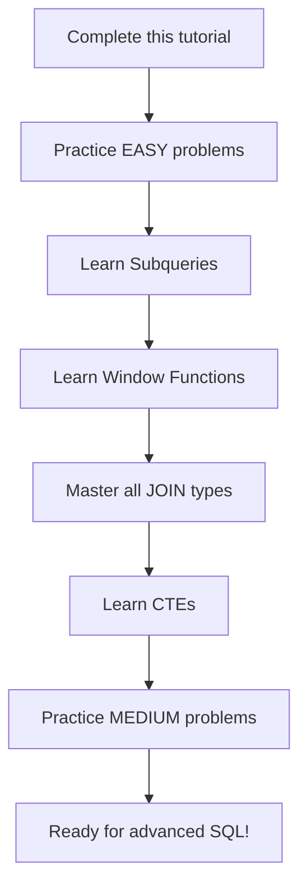

# SQL Tutorial for Beginners - Complete 3.5 Hour Guide

A comprehensive step-by-step SQL tutorial covering everything from database creation to advanced queries with practical examples.

## Table of Contents

### Setup & Fundamentals

- [[#Database Setup|Database Setup]]
- [[#Understanding Database Concepts|Understanding Database Concepts]]
- [[#Creating Your First Table|Creating Your First Table]]

### Basic Operations (CRUD)

- [[#Loading Data (CREATE)|Loading Data (CREATE)]]
- [[#Reading Data (READ)|Reading Data (READ)]]
- [[#Modifying Data (UPDATE)|Modifying Data (UPDATE)]]
- [[#Removing Data (DELETE)|Removing Data (DELETE)]]

### Advanced Table Operations

- [[#Table Management|Table Management]]
- [[#Constraints & Data Integrity|Constraints & Data Integrity]]
- [[#Building a Complete Database|Building a Complete Database]]

### Real-World Practice

- [[#20 SQL Queries Case Study|20 SQL Queries Case Study]]
- [[#Next Steps & Resources|Next Steps & Resources]]

---

## Database Setup

### Step 1: Initial Setup

1. **Download PostgreSQL** and install PgAdmin
2. **Download all scripts** from the provided resources
3. **Connect to PostgreSQL server**

### Step 2: Create Database

```sql
-- Understand relational database concepts
SELECT * FROM information_schema.tables;

-- Create your demo database
CREATE DATABASE demo;
```

### Step 3: Connect to Database

Login to the `demo` database through PgAdmin tool.

> [!info] What is a Relational Database? A relational database stores data in tables with rows and columns, where relationships between different tables can be established through foreign keys.

---

## Understanding Database Concepts

### Core Concepts

- **Table**: A collection of related data organized in rows and columns
- **Column**: A vertical entity representing a data attribute
- **Row**: A horizontal entity representing a single record
- **Data Types**: Define what kind of data can be stored in each column

---

## Creating Your First Table

### Step 4: Create Simple Table

```sql
-- Create a products table with various data types
CREATE TABLE products (
    id INT,
    name VARCHAR(50),
    price FLOAT,
    release_date DATE
);
```

> [!note] Common Data Types
> 
> - **INT**: Integer numbers
> - **VARCHAR(n)**: Variable-length strings up to n characters
> - **FLOAT**: Decimal numbers
> - **DATE**: Date values (YYYY-MM-DD format)

---

## Loading Data (CREATE)

### Step 5: Insert Data into Tables

#### Basic INSERT Statements

```sql
-- Single record insertion
INSERT INTO products (id, name, price, release_date) 
VALUES (1, 'iPhone 15', 900, '22-08-2023');

INSERT INTO products (id, name, price, release_date) 
VALUES (2, 'Macbook Pro', 2000, '10-02-2021');

INSERT INTO products (id, name, price, release_date) 
VALUES (3, 'AirPods', 400, '15-04-2022');
```

#### Using Date Functions

```sql
-- Using to_date function for better date handling
INSERT INTO products (id, name, price, release_date) 
VALUES (1, 'iPhone 15', 900, to_date('22-08-2023', 'dd-mm-yyyy'));

INSERT INTO products (id, name, price, release_date) 
VALUES (2, 'Macbook Pro', 2000, to_date('10-02-2021', 'dd-mm-yyyy'));

INSERT INTO products (id, name, price, release_date) 
VALUES (3, 'AirPods', 400, to_date('15-04-2022', 'dd-mm-yyyy'));
```

---

## Reading Data (READ)

### Step 6: Query Data from Tables

#### Basic SELECT Operations

```sql
-- Fetch all columns and rows
SELECT * FROM products;

-- Fetch selected rows with conditions
SELECT * FROM products WHERE price > 500;

-- Fetch specific columns only
SELECT name FROM products;

-- Use column aliases for better readability
SELECT name AS Product_name FROM products;
```

#### Working with Table Aliases

```sql
-- Give alias to table for shorter references
SELECT name AS Product_name FROM products p;
SELECT p.name AS Product_name FROM products p;
```

#### Date-Based Filtering

```sql
-- Fetch products released in 2023 (Method 1)
SELECT name FROM products 
WHERE to_char(release_date, 'yyyy') = '2023';

-- Fetch products released in 2023 (Method 2)
SELECT name FROM products 
WHERE extract(year FROM release_date) = 2023;
```

#### Aggregate Functions

```sql
-- Get total number of products
SELECT count(*) FROM products;

-- Get average price of all products
SELECT avg(price) FROM products;

-- Get multiple aggregations
SELECT 
    avg(price) AS avg_cost, 
    sum(price) AS total_sum 
FROM products;
```

> [!tip] Performance Tip Use specific column names instead of `SELECT *` when you don't need all columns - it improves query performance and reduces network traffic.

---

## Modifying Data (UPDATE)

### Step 7: Update Existing Records

#### Basic UPDATE Operations

```sql
-- ❌ Wrong: This will update ALL records with id = 1
UPDATE products 
SET price = 1000 
WHERE id = 1;

-- ✅ Better: Update by unique product name
UPDATE products 
SET price = 1000 
WHERE name = 'iPhone 15';

-- ✅ Update using pattern matching
UPDATE products 
SET price = 1000 
WHERE name LIKE 'iPhone%';
```

> [!warning] UPDATE Safety Always use specific WHERE clauses in UPDATE statements. Without proper conditions, you might accidentally update all rows in your table!

---

## Removing Data (DELETE)

### Step 8: Delete Records

#### Selective DELETE Operations

```sql
-- Remove products costing over 1000
DELETE FROM products WHERE price > 1000;

-- Remove all products except iPhone variants
DELETE FROM products WHERE name NOT LIKE 'iPhone%';
```

#### Complete Data Removal

```sql
-- Remove all products (slower, can be rolled back)
DELETE FROM products;

-- Remove all products (faster, cannot be rolled back)
TRUNCATE TABLE products;
```

> [!info] DELETE vs TRUNCATE
> 
> - **DELETE**: Removes rows one by one, can be rolled back, slower
> - **TRUNCATE**: Removes all rows at once, cannot be rolled back, faster

---

## Table Management

### Step 9: Create Backup Tables

#### Complete Table Backup

```sql
-- Create backup with structure and data
CREATE TABLE products_bkp AS 
SELECT * FROM products;

-- Create empty backup with only structure
CREATE TABLE products_bkp AS 
SELECT * FROM products WHERE 1=2;
```

### Step 10: Remove Tables

```sql
-- Drop table (will fail if table doesn't exist)
DROP TABLE products;

-- Drop table safely
DROP TABLE IF EXISTS products;
```

### Step 11: Modify Table Structure

#### Rename Operations

```sql
-- Rename table
ALTER TABLE products_bkp RENAME TO products;

-- Rename column
ALTER TABLE products RENAME COLUMN name TO product_name;
```

#### Modify Data Types

```sql
-- Change data type of price column
ALTER TABLE products ALTER COLUMN price TYPE INT;
```

---

## Constraints & Data Integrity

### Step 12: Primary Key Constraints

#### Method 1: Inline Primary Key

```sql
CREATE TABLE products (
    id INT PRIMARY KEY,
    name VARCHAR(50),
    price FLOAT,
    release_date DATE
);
```

#### Method 2: Named Constraint

```sql
CREATE TABLE products (
    id INT,
    name VARCHAR(50),
    price FLOAT,
    release_date DATE,
    CONSTRAINT pk_prd PRIMARY KEY(id)
);
```

#### Method 3: Composite Primary Key

```sql
CREATE TABLE products (
    id INT,
    name VARCHAR(50),
    price FLOAT,
    release_date DATE,
    CONSTRAINT pk_prd PRIMARY KEY(id, name)
);
```

> [!info] Composite Primary Key Allows creating a primary key using multiple columns. Useful when no single column can uniquely identify a row.

### Step 13: Identity Columns & Auto-Increment

#### Create Table with Auto-Increment ID

```sql
CREATE TABLE products (
    id INT GENERATED ALWAYS AS IDENTITY PRIMARY KEY,
    name VARCHAR(50),
    price FLOAT,
    release_date DATE
);
```

#### Insert Data with Auto-Generated IDs

```sql
-- Use DEFAULT for auto-generated ID columns
INSERT INTO products (id, name, price, release_date) 
VALUES (default, 'iPhone 15', 900, to_date('22-08-2023','dd-mm-yyyy'));

INSERT INTO products (id, name, price, release_date) 
VALUES (default, 'Macbook Pro', 2000, to_date('10-02-2021','dd-mm-yyyy'));

INSERT INTO products (id, name, price, release_date) 
VALUES (default, 'AirPods', 400, to_date('15-04-2022','dd-mm-yyyy'));
```

---

## Building a Complete Database

### Step 14: Create Sales Order Dataset

#### Products Table

```sql
DROP TABLE IF EXISTS products;
CREATE TABLE products (
    id INT GENERATED ALWAYS AS IDENTITY PRIMARY KEY,
    name VARCHAR(100),
    price FLOAT,
    release_date DATE
);

INSERT INTO products VALUES
    (default,'iPhone 15', 800, to_date('22-08-2023','dd-mm-yyyy')),
    (default,'Macbook Pro', 2100, to_date('12-10-2022','dd-mm-yyyy')),
    (default,'Apple Watch 9', 550, to_date('04-09-2022','dd-mm-yyyy')),
    (default,'iPad', 400, to_date('25-08-2020','dd-mm-yyyy')),
    (default,'AirPods', 420, to_date('30-03-2024','dd-mm-yyyy'));
```

#### Customers Table

```sql
DROP TABLE IF EXISTS customers;
CREATE TABLE customers (
    id INT GENERATED ALWAYS AS IDENTITY PRIMARY KEY,
    name VARCHAR(100),
    email VARCHAR(30)
);

INSERT INTO customers VALUES
    (default,'Meghan Harley', 'mharley@demo.com'),
    (default,'Rosa Chan', 'rchan@demo.com'),
    (default,'Logan Short', 'lshort@demo.com'),
    (default,'Zaria Duke', 'zduke@demo.com');
```

#### Employees Table

```sql
DROP TABLE IF EXISTS employees;
CREATE TABLE employees (
    id INT GENERATED ALWAYS AS IDENTITY PRIMARY KEY,
    name VARCHAR(100)
);

INSERT INTO employees VALUES
    (default,'Nina Kumari'),
    (default,'Abrar Khan'),
    (default,'Irene Costa');
```

### Step 15: Foreign Key Constraints

#### Sales Order Table with Foreign Keys

```sql
DROP TABLE IF EXISTS sales_order;
CREATE TABLE sales_order (
    order_id INT GENERATED ALWAYS AS IDENTITY PRIMARY KEY,
    order_date DATE,
    quantity INT,
    prod_id INT REFERENCES products(id),
    status VARCHAR(20),
    customer_id INT REFERENCES customers(id),
    emp_id INT,
    CONSTRAINT fk_so_emp FOREIGN KEY (emp_id) REFERENCES employees(id)
);
```

#### Sample Sales Data

```sql
INSERT INTO sales_order VALUES
    (default,to_date('01-01-2024','dd-mm-yyyy'),2,1,'Completed',1,1),
    (default,to_date('01-01-2024','dd-mm-yyyy'),3,1,'Pending',2,2),
    (default,to_date('02-01-2024','dd-mm-yyyy'),3,2,'Completed',3,2),
    (default,to_date('03-01-2024','dd-mm-yyyy'),3,3,'Completed',3,2),
    (default,to_date('04-01-2024','dd-mm-yyyy'),1,1,'Completed',3,2),
    (default,to_date('04-01-2024','dd-mm-yyyy'),1,3,'completed',2,1),
    (default,to_date('04-01-2024','dd-mm-yyyy'),1,2,'On Hold',2,1),
    (default,to_date('05-01-2024','dd-mm-yyyy'),4,2,'Rejected',1,2),
    (default,to_date('06-01-2024','dd-mm-yyyy'),5,5,'Completed',1,2),
    (default,to_date('06-01-2024','dd-mm-yyyy'),1,1,'Cancelled',1,1);
```

> [!info] Foreign Key Benefits Foreign keys ensure referential integrity - you cannot insert invalid references to non-existent records in related tables.

### Step 16: Dropping Tables with Constraints

```sql
-- ❌ Cannot drop parent tables first
DROP TABLE IF EXISTS products;  -- Will fail
DROP TABLE IF EXISTS customers; -- Will fail
DROP TABLE IF EXISTS employees;  -- Will fail

-- ✅ Drop child table first, then parent tables
DROP TABLE IF EXISTS sales_order;
DROP TABLE IF EXISTS products;
DROP TABLE IF EXISTS customers;
DROP TABLE IF EXISTS employees;
```

---

## 20 SQL Queries Case Study

### Step 17: Real-World Query Examples

#### 1. Total Products Sold

```sql
-- Identify the total number of products sold
SELECT sum(quantity) AS total_products 
FROM sales_order;
```

#### 2. Delivery Status Analysis

```sql
-- Other than Completed, display available delivery statuses
SELECT DISTINCT status 
FROM sales_order 
WHERE status <> 'Completed';

-- Handle case sensitivity
SELECT DISTINCT status 
FROM sales_order 
WHERE lower(status) <> 'completed';
```

#### 3. Completed Orders with Product Details

```sql
-- Display order_id, order_date and product_name for completed orders
SELECT so.order_id, so.order_date, p.name
FROM sales_order so
JOIN products p ON p.id = so.prod_id
WHERE lower(so.status) = 'completed';
```

#### 4. Comprehensive Order Details

```sql
-- Sort by earliest orders and include customer information
SELECT 
    so.order_id, 
    so.order_date, 
    p.name AS product, 
    c.name AS customer
FROM sales_order so
JOIN products p ON p.id = so.prod_id
JOIN customers c ON c.id = so.customer_id
WHERE lower(so.status) = 'completed'
ORDER BY so.order_date;
```

#### 5. Orders by Delivery Status

```sql
-- Display total orders corresponding to each delivery status
SELECT status, count(*) AS tot_orders
FROM sales_order
GROUP BY status;
```

#### 6. Incomplete Multi-Item Orders

```sql
-- Count orders not completed for purchases > 1 item
SELECT count(status) AS not_completed_orders
FROM sales_order
WHERE quantity > 1 AND lower(status) <> 'completed';
```

#### 7. Case-Insensitive Status Grouping

```sql
-- Method 1: Using CASE statement
SELECT status, count(*) AS tot_orders
FROM (
    SELECT 
        CASE 
            WHEN lower(status) = 'completed' THEN 'Completed'
            ELSE status 
        END AS status
    FROM sales_order
) sq
GROUP BY status
ORDER BY tot_orders DESC;

-- Method 2: Using UPPER function
SELECT upper(status) AS status, count(*) AS tot_orders
FROM sales_order
GROUP BY upper(status)
ORDER BY tot_orders DESC;
```

#### 8. Customer Purchase Analysis

```sql
-- Total products purchased by each customer
SELECT c.name AS customer, sum(quantity) AS total_products
FROM sales_order so
JOIN customers c ON c.id = so.customer_id
GROUP BY c.name;
```

#### 9. Daily Sales Analysis

```sql
-- Total sales and average sales for each day
SELECT 
    order_date,
    sum(quantity * price) AS total_sales,
    avg(quantity * p.price) AS avg_sales
FROM sales_order so
JOIN products p ON p.id = so.prod_id
GROUP BY order_date
ORDER BY order_date;
```

#### 10. On Hold/Pending Orders Analysis

```sql
-- Customer, employee, and total sale amount for hold/pending orders
SELECT 
    c.name AS customer,
    e.name AS employee,
    sum(quantity * p.price) AS total_sales
FROM sales_order so
JOIN employees e ON e.id = so.emp_id
JOIN customers c ON c.id = so.customer_id
JOIN products p ON p.id = so.prod_id
WHERE status IN ('On Hold', 'Pending')
GROUP BY c.name, e.name;
```

#### 11. Complex Filter Conditions

```sql
-- Orders not completed/pending OR handled by Abrar
SELECT e.name AS employee, so.*
FROM sales_order so
JOIN employees e ON e.id = so.emp_id
WHERE lower(e.name) LIKE '%abrar%' 
   OR lower(status) NOT IN ('completed', 'pending');
```

#### 12. High-Value Orders Excluding MacBook

```sql
-- Orders > 2000 but not MacBook Pro
SELECT (so.quantity * p.price) AS total_sale, so.*
FROM sales_order so
JOIN products p ON p.id = so.prod_id
WHERE prod_id NOT IN (
    SELECT id FROM products WHERE name = 'Macbook Pro'
)
AND (so.quantity * p.price) > 2000;
```

#### 13. Customers Without Purchases

```sql
-- Method 1: Using NOT IN
SELECT * FROM customers 
WHERE id NOT IN (SELECT DISTINCT customer_id FROM sales_order);

-- Method 2: Using LEFT JOIN
SELECT c.*
FROM customers c
LEFT JOIN sales_order so ON so.customer_id = c.id
WHERE so.order_id IS NULL;

-- Method 3: Using RIGHT JOIN
SELECT c.*
FROM sales_order so
RIGHT JOIN customers c ON so.customer_id = c.id
WHERE so.order_id IS NULL;
```

#### 14. All Customers with Purchase Totals

```sql
-- Include customers with zero purchases
SELECT 
    c.name,
    coalesce(sum(quantity), 0) AS tot_prod_purchased
FROM sales_order so
RIGHT JOIN customers c ON c.id = so.customer_id
GROUP BY c.name
ORDER BY tot_prod_purchased DESC;
```

#### 15. Employee Sales Performance

```sql
-- Total sales by employee for completed orders
SELECT 
    e.name AS employee,
    coalesce(sum(p.price * so.quantity), 0) AS total_sale
FROM sales_order so
JOIN products p ON p.id = so.prod_id
RIGHT JOIN employees e ON e.id = so.emp_id 
    AND lower(so.status) = 'completed'
GROUP BY e.name
ORDER BY total_sale DESC;
```

#### 16. Employee-Customer Sales Matrix

```sql
-- Sales by employee for each customer
SELECT 
    e.name AS employee,
    coalesce(c.name, '-') AS customer,
    coalesce(sum(p.price * so.quantity), 0) AS total_sale
FROM sales_order so
JOIN products p ON p.id = so.prod_id
JOIN customers c ON c.id = so.customer_id
RIGHT JOIN employees e ON e.id = so.emp_id 
    AND lower(so.status) = 'completed'
GROUP BY e.name, c.name
ORDER BY total_sale DESC;
```

#### 17. High-Value Sales Filter

```sql
-- Only sales above 1000
SELECT 
    e.name AS employee,
    coalesce(c.name, '-') AS customer,
    coalesce(sum(p.price * so.quantity), 0) AS total_sale
FROM sales_order so
JOIN products p ON p.id = so.prod_id
JOIN customers c ON c.id = so.customer_id
RIGHT JOIN employees e ON e.id = so.emp_id 
    AND lower(so.status) = 'completed'
GROUP BY e.name, c.name
HAVING sum(p.price * so.quantity) > 1000
ORDER BY total_sale DESC;
```

#### 18. Multi-Customer Employees

```sql
-- Employees who served more than 2 customers
SELECT 
    e.name,
    count(DISTINCT c.name) AS total_customers
FROM sales_order so
JOIN employees e ON e.id = so.emp_id
JOIN customers c ON c.id = so.customer_id
GROUP BY e.name
HAVING count(DISTINCT c.name) > 2;
```

#### 19. High-Volume Customers

```sql
-- Customers who purchased more than 5 products
SELECT 
    c.name AS customer,
    sum(quantity) AS total_products_purchased
FROM sales_order so
JOIN customers c ON c.id = so.customer_id
GROUP BY c.name
HAVING sum(quantity) > 5;
```

#### 20. Above-Average Customers

```sql
-- Customers whose average purchase exceeds overall average
SELECT 
    c.name AS customer,
    avg(quantity * p.price) AS avg_purchase
FROM sales_order so
JOIN customers c ON c.id = so.customer_id
JOIN products p ON p.id = so.prod_id
GROUP BY c.name
HAVING avg(quantity * p.price) > (
    SELECT avg(quantity * p.price)
    FROM sales_order so
    JOIN products p ON p.id = so.prod_id
);
```

---

## Next Steps & Resources

### Step 18: Continue Your SQL Journey

#### A. Practice Platform

**LeetCode SQL Problems**: Start with EASY difficulty problems

- Practice daily to build muscle memory
- Focus on understanding different query patterns
- Gradually move to MEDIUM difficulty

#### B. Advanced Concepts to Learn

##### 1. Subqueries

**Resource**: [Subqueries Tutorial](https://youtu.be/nJIEIzF7tDw?si=eY80AgiXEcluDk1Y)

- Nested queries within other queries
- Correlated vs non-correlated subqueries
- EXISTS and NOT EXISTS clauses

##### 2. Window Functions

**Resources**:

- [Window Functions Part 1](https://youtu.be/Ww71knvhQ-s?si=kK5nG-A3MDZkg8IF)
- [Window Functions Part 2](https://youtu.be/zAmJPdZu8Rg?si=_6LS1jhuVTW-L71L)

Topics covered:

- ROW_NUMBER(), RANK(), DENSE_RANK()
- SUM(), AVG(), COUNT() OVER()
- Partitioning and ordering
- Lead and lag functions

##### 3. All Types of JOINS

**Resources**:

- [JOIN Types Tutorial 1](https://youtu.be/0OQJDd3QqQM?si=pTj48kJU7paEo__o)
- [JOIN Types Tutorial 2](https://youtu.be/RehbnzKHS28?si=LNFUMwDsH9MucRcD)

Join types to master:

- INNER JOIN
- LEFT JOIN / LEFT OUTER JOIN
- RIGHT JOIN / RIGHT OUTER JOIN
- FULL OUTER JOIN
- CROSS JOIN
- SELF JOIN

##### 4. Common Table Expressions (CTE)

**Resource**: [WITH Clause Tutorial](https://youtu.be/QNfnuK-1YYY?si=naQ-aiGL06PoPBEw)

- WITH clause syntax
- Recursive CTEs
- Multiple CTEs in single query
- Performance considerations

#### C. Learning Path Recommendation



> [!success] Congratulations! You've completed a comprehensive SQL tutorial covering all fundamental concepts. With consistent practice and exploration of advanced topics, you'll become proficient in SQL database operations.

---

## Quick Reference Card

### Essential Commands

```sql
-- Database & Table Operations
CREATE DATABASE database_name;
CREATE TABLE table_name (columns...);
ALTER TABLE table_name ADD/DROP/MODIFY...;
DROP TABLE table_name;

-- Data Operations
INSERT INTO table VALUES (...);
SELECT columns FROM table WHERE condition;
UPDATE table SET column = value WHERE condition;
DELETE FROM table WHERE condition;

-- Constraints
PRIMARY KEY
FOREIGN KEY
NOT NULL
UNIQUE

-- Joins
INNER JOIN
LEFT JOIN
RIGHT JOIN
FULL OUTER JOIN

-- Aggregation
GROUP BY
HAVING
ORDER BY
COUNT(), SUM(), AVG(), MIN(), MAX()
```

---

## Tags

#sql #database #postgresql #tutorial #beginner #joins #constraints #queries #data-analysis #crud-operations